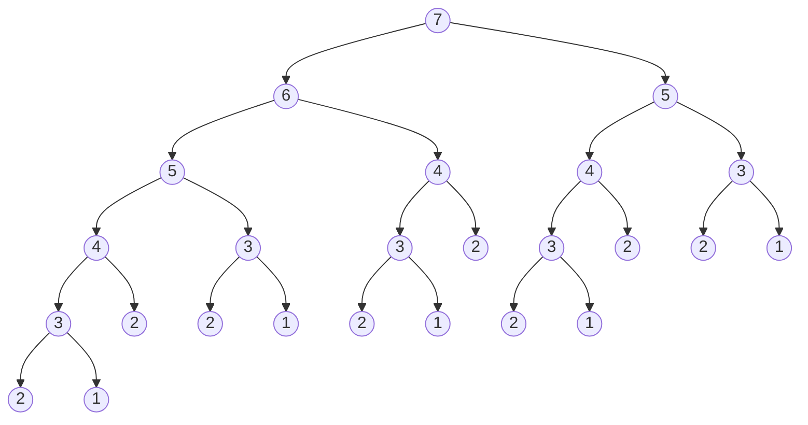

```mermaid
graph TD
    A((7)) --> B((6))
    A --> C((5))

    B --> D((5))
    B --> E((4))

    C --> F((4))
    C --> G((3))

    D --> H((4))
    D --> I((3))

    E --> J((3))
    E --> K((2))

    F --> L((3))
    F --> M((2))

    G --> N((2))
    G --> O((1))

    H --> P((3))
    H --> Q((2))

    I --> R((2))
    I --> S((1))

    J --> T((2))
    J --> U((1))

    L --> V((2))
    L --> W((1))

    P --> X((2))
    P --> Y((1))
```