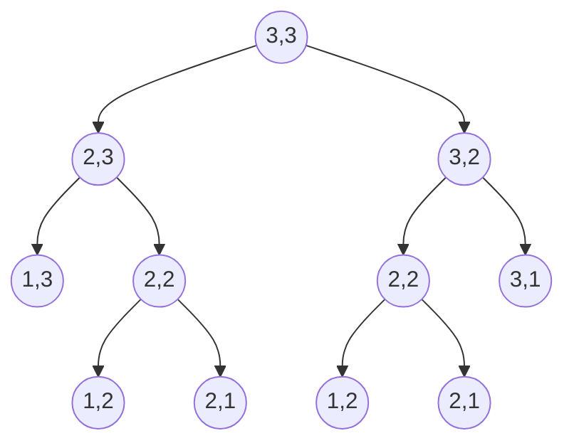

```mermaid
graph TD
    A((3,3)) --> B((2,3))
    A --> C((3,2))
    
    B --> D((1,3))
    B --> E((2,2))

    C --> F((2,2))
    C --> G((3,1))

    E --> H((1,2))
    E --> I((2,1))

    F --> J((1,2))
    F --> K((2,1))
```