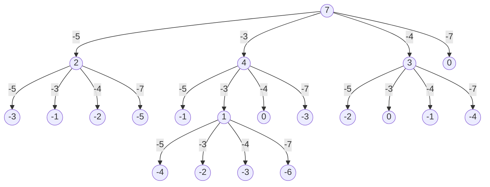

```mermaid
graph TD
    A((7)) --> |-5| B((2))
    A --> |-3| C((4))
    A --> |-4| D((3))
    A --> |-7| E((0))

    B --> |-5| F(("-3"))
    B --> |-3| G(("-1"))
    B --> |-4| H(("-2"))
    B --> |-7| I(("-5"))

    C --> |-5| J(("-1"))
    C --> |-3| K(("1"))
    C --> |-4| L(("0"))
    C --> |-7| M(("-3"))

    D --> |-5| N(("-2"))
    D --> |-3| O(("0"))
    D --> |-4| P(("-1"))
    D --> |-7| Q(("-4"))

    K --> |-5| R(("-4"))
    K --> |-3| S(("-2"))
    K --> |-4| T(("-3"))
    K --> |-7| U(("-6"))
```